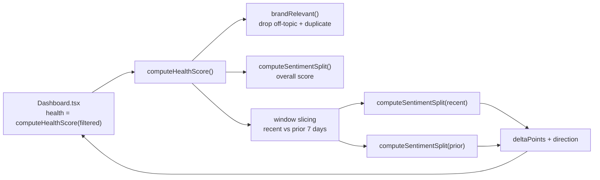
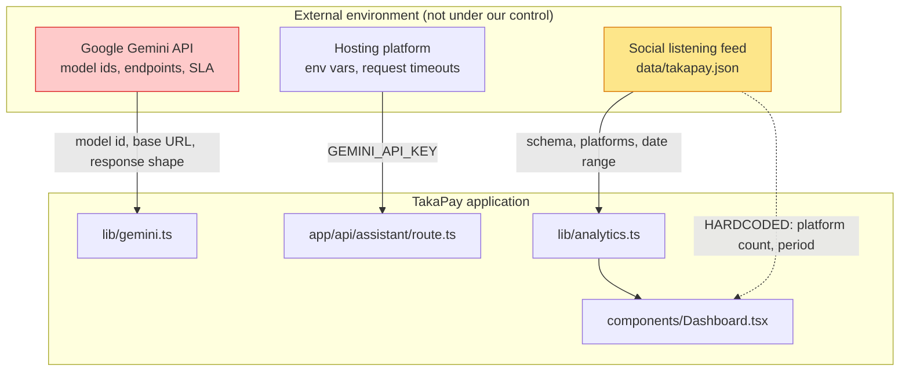
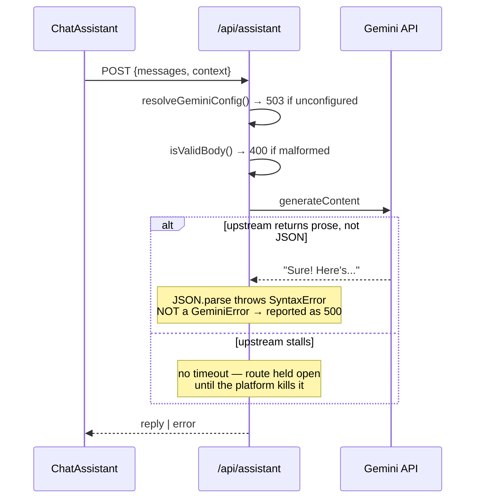
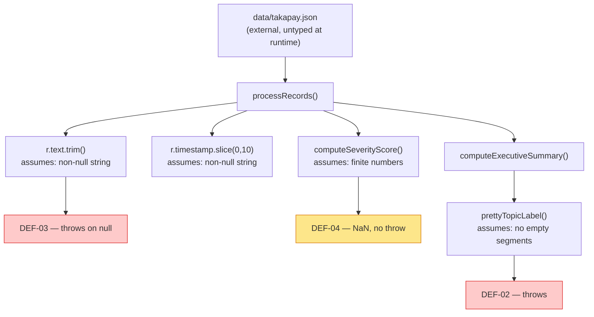
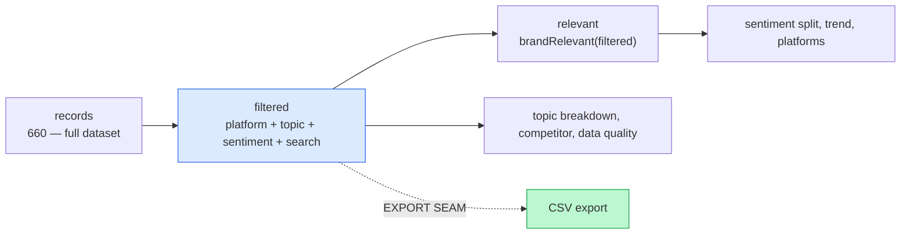
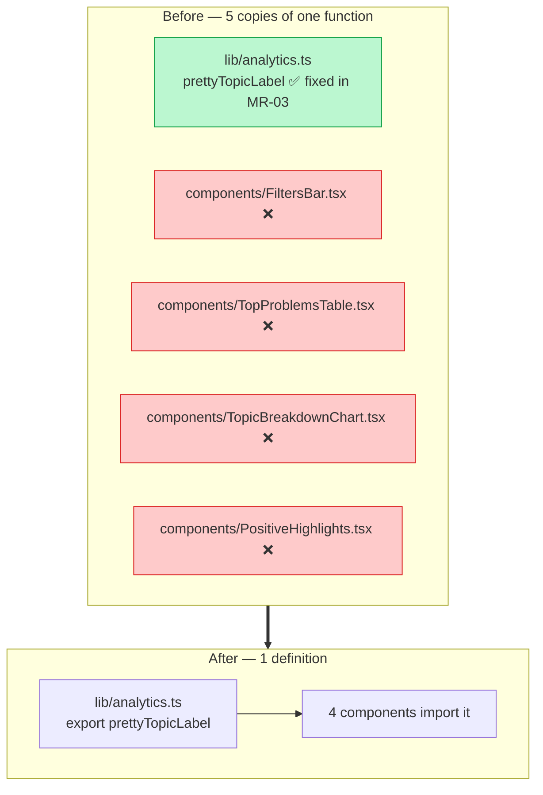
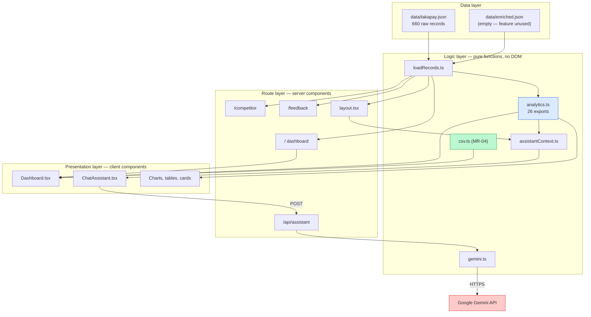
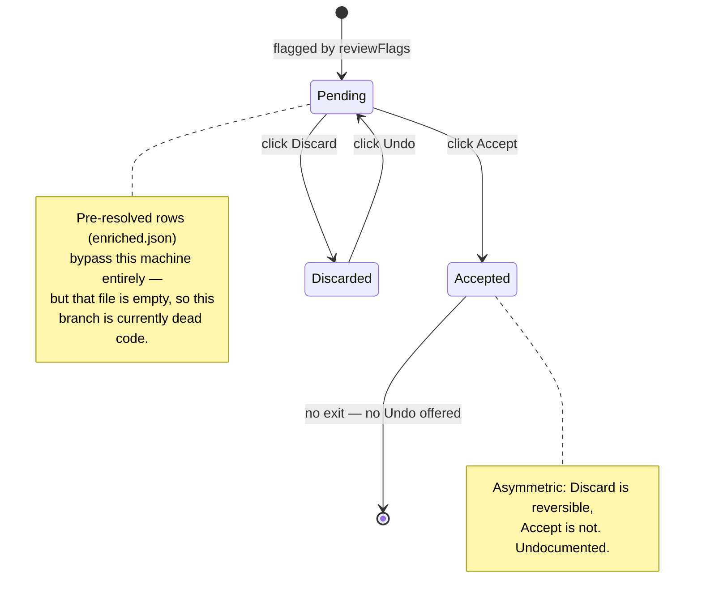

# Software Maintenance Simulation — TakaPay Social Listening Dashboard

**Name:** Tasnim Ashraf
**Student ID:** 210042122
**Course:** Software Maintenance
**Subject system:** `codenim34/deepdive-takapay` — TakaPay Social Listening Dashboard
**Branch:** `claude/software-maintenance-simulation-b62bsl`
**Baseline commit:** `f8e5c50`
**Date:** 18 August 2026

---

## 1. Executive Summary

This report documents a full maintenance cycle carried out on a live Next.js application, covering the four maintenance categories defined in **ISO/IEC 14764**. Each category was delivered as a separate Maintenance Release (MR) with its own commit, and each was worked through the same five activities: **program comprehension, change management, impact analysis, reverse engineering, and refactoring**.

The work is not a paper exercise. Every defect described here was **reproduced before it was fixed** and **re-verified after**, and every regression test written was **confirmed to fail against the pre-fix source** before being accepted as a guard.

| MR | Category | Change | Commit | Files | +/− |
|----|----------|--------|--------|-------|-----|
| MR-01 | Corrective | Fix timezone-dependent brand-health trend window | `0b2a7fd` | 1 | +44 / −8 |
| MR-02 | Adaptive | Absorb upstream API and data-feed change via configuration | `696f1af` | 5 | +164 / −20 |
| MR-03 | Preventive | Regression suite + containment of latent crash points | `154ee53` | 5 | +490 / −16 |
| MR-04 | Perfective | CSV export of the current view + clone elimination | `d2a1e6b` | 10 | +345 / −41 |
| | | **Total vs baseline** | | **15** | **+1043 / −85** |

**Headline outcomes**

- **4 defects found and fixed**, of which **1 was actively producing wrong numbers in production** and 3 were latent.
- **36 automated tests** added where the project previously had **zero**.
- **1 standing lint error** cleared; repository now passes typecheck, lint, tests and build cleanly.
- **5 copies of one function reduced to 1**, which retro-actively propagated an earlier fix to four components that had silently missed it.

---

## 2. The System Under Maintenance

TakaPay is a social listening dashboard that turns 660 multilingual (Bangla / English / Banglish) social media posts about a fictional mobile wallet into insight for a non-technical brand manager.

| Property | Value |
|---|---|
| Stack | Next.js 16.2.10 (App Router), React 19.2.4, TypeScript 5, Tailwind 4, Recharts 3 |
| Source size at baseline | 1,877 LOC across 25 files |
| Data | 660 records, 7 platforms, 15 topics, 30 days (2026-06-01 → 2026-06-30) |
| External dependency | Google Gemini API (Brand Assistant only) |
| Tests at baseline | **none** |
| CI at baseline | **none** |

### 2.1 Maintainability assessment of the inherited code

Before changing anything, the inherited codebase was assessed. It is, on the whole, **well above average for a take-home project** — which matters, because it changes what kind of maintenance is worth doing.

**Strengths.** The core pipeline is a set of pure functions over immutable inputs, with a stated and consistently applied design principle ("flag, don't modify"). Comments explain *why* rather than *what* — the score-over-label decision and the log-compression of engagement are both justified in place. This made program comprehension unusually fast.

**Weaknesses, and what they implied.** No test suite at all, so every change carried unbounded regression risk and *nothing could be safely refactored until that was addressed*. Presentation concerns leak into `lib/analytics.ts` (`riskLabel` returns Tailwind class strings). External inputs are trusted without coercion. And one function had been copy-pasted into five files.

That assessment set the order of work: **MR-03's tests were sequenced before MR-04's refactor deliberately**, because refactoring a system with no regression net is not maintenance, it is gambling.

---

## 3. Method

Each of the five required activities was given an operational definition, so that "doing the activity" meant producing a specific artefact rather than making a claim.

| Activity | Operational definition used | Evidence produced |
|---|---|---|
| **Program comprehension** | Build a defensible mental model of the code *before* editing, working bottom-up from source and top-down from behaviour | Module graphs, call chains, execution traces |
| **Change management** | Record the request, classify it, assess and approve it, control the version, and trace it | MR register, defect register, atomic commits, traceability matrix |
| **Impact analysis** | Identify the ripple effect — what else can change — *before* the edit, then check the prediction afterwards | Predicted vs actual impact sets, fan-in counts |
| **Reverse engineering** | Recover design information not present in the documentation, at a higher abstraction than the code | Recovered diagrams, inferred contracts, state machines |
| **Refactoring** | Change internal structure without changing external behaviour, verified as behaviour-preserving | Before/after structure, preservation evidence |

**Verification gate.** Every MR had to pass `npm run verify` (typecheck + lint + tests) and `npm run build` before being committed.

### 3.1 Baseline measurements

Taken on the untouched baseline so that all later claims are relative to a measured starting point:

```
tsc --noEmit    → clean
eslint          → 1 error (react-hooks/set-state-in-effect, components/Sidebar.tsx:18)
next build      → success, 7 routes
tests           → none exist
```

---

## 4. MR-01 — Corrective Maintenance

> **Corrective maintenance:** reactive modification to correct discovered problems. *(ISO/IEC 14764)*

### 4.1 Program comprehension

Comprehension began **top-down from an observable output**: the dashboard's headline claim *"Brand health trending down N points over the last week compared to the week before."* The question asked was simply — is that number right?

Following the value backwards produced this call chain:



Reading the window-slicing block closely surfaced a **representation mismatch**. `ProcessedRecord` carries the same instant in two different forms, created two lines apart:

```ts
const date = new Date(r.timestamp.replace(" ", "T"));  // "2026-06-30T01:16:00" → HOST-LOCAL
const day  = r.timestamp.slice(0, 10);                 // "2026-06-30"          → a plain string
```

The slicing code then compared **one against the other**:

```ts
const cutoff = new Date(lastDay);          // "2026-06-30" → parsed as UTC MIDNIGHT
const recentWindow = relevant.filter((r) => r.date >= sevenDaysAgo && r.date <= cutoff);
```

This is the ECMAScript date-parsing rule that catches almost everyone: a **date-time** string without a zone designator is parsed as *local* time, while a **date-only** string is parsed as *UTC*. The two values are on different clocks, so `r.date <= cutoff` is not the comparison it appears to be.

### 4.2 Reverse engineering

The documentation says only "the most recent 7 days against the 7 days before that". The **actual implemented behaviour** was recovered by execution against the real dataset under four host timezones:

| Host timezone | Posts on newest day (2026-06-30) | Included in "recent" window | Reported trend |
|---|---|---|---|
| UTC | 16 | **0** | −6 pts |
| Asia/Dhaka (UTC+6) | 16 | **7** | −3 pts |
| America/Los_Angeles (UTC−7) | 16 | **0** | −6 pts |
| Pacific/Kiritimati (UTC+14) | 16 | 16 | −6 pts |

Two distinct faults, recovered rather than assumed:

1. **The newest day of data was being silently discarded** from the recent window — the single most decision-relevant day for a brand manager.
2. **The output was a function of where the server happened to run.** The same input produced −3 or −6 depending on deployment region. In Next.js this is worse than it appears: the component renders on the server and hydrates on the client, so a server in UTC and a browser in Dhaka could legitimately disagree across the hydration boundary.

The recovered intent — two adjacent, non-overlapping, 7-day windows ending inclusively on the newest day — was also **not what the old code computed**: `[lastDay−7, lastDay]` spans eight calendar days, not seven. The documentation and the implementation had drifted apart.

### 4.3 Impact analysis

| Dimension | Finding |
|---|---|
| Changed unit | `computeHealthScore()` in `lib/analytics.ts` |
| Direct callers | 2 — `components/Dashboard.tsx`, `lib/assistantContext.ts` |
| Signature change | **None** — inputs and return type unchanged, so the ripple is confined to *values*, not *types* |
| Affected UI | Brand Health stat card, health detail modal, executive summary bullet |
| **Non-obvious propagation** | `assistantContext.ts` feeds the health delta into the **Gemini system prompt**. A wrong delta does not just render wrongly — it becomes a premise the AI assistant reasons from and repeats in prose |
| Data risk | None — read-only computation over an immutable in-memory dataset |
| Rollback | Single-file, single-function revert |

That third-order effect (defect → prompt → AI-asserted narrative) is exactly what impact analysis is for: it is invisible in the call graph of the UI, and only appears when you follow the data rather than the control flow.

### 4.4 The change

Slice on the `day` **string** rather than the parsed `Date`. `YYYY-MM-DD` sorts lexicographically in true chronological order, so the comparison is exact and carries no timezone whatsoever.

```ts
const lastDay = days[days.length - 1];
const recentWindow = sliceByDayWindow(relevant, shiftDay(lastDay, -6), lastDay);
const priorWindow  = sliceByDayWindow(relevant, shiftDay(lastDay, -13), shiftDay(lastDay, -7));
```

### 4.5 Refactoring

Two pure helpers were extracted from the inlined arithmetic:

| Extracted | Purpose | Why it is better |
|---|---|---|
| `shiftDay(day, delta)` | Whole-day arithmetic on `YYYY-MM-DD` keys | Anchored at **UTC noon**, so a DST transition can never push the result onto the neighbouring date — a second latent bug avoided by construction |
| `sliceByDayWindow(records, from, to)` | Inclusive day-key range filter | Names the boundary semantics that were previously implicit in `>=` / `<=` / `<` |

Both were **exported specifically so the boundary behaviour could be pinned by tests** in MR-03 — refactoring done in service of testability, not tidiness.

### 4.6 Verification

| Metric | Before | After |
|---|---|---|
| Newest-day posts counted | 0–16, timezone-dependent | **16, always** |
| Recent / prior window size | 141–150 / 139–151 | **140 / 144, stable** |
| Reported delta | −3 or −6 depending on host | **−4 in every timezone** |
| Window span | 8 days vs 7 days | 7 days vs 7 days |

> Note that the *corrected* answer (−4) is one no timezone previously produced. The defect was not a rounding nuisance; every deployment was reporting a wrong figure.

### 4.7 Change management record

| Field | Value |
|---|---|
| Change request | CR-01 — "Verify the brand-health trend figure is trustworthy" |
| Classification | Corrective — Priority **High** |
| Defect id | DEF-01 |
| Justification | Headline business metric incorrect on every deployment; propagates into AI assistant output |
| Approval | Approved for immediate release; behaviour-restoring, no signature change, single-file rollback |
| Commit | `0b2a7fd` |
| Verification | `npm run verify` clean; 4-timezone differential test |

---

## 5. MR-02 — Adaptive Maintenance

> **Adaptive maintenance:** modification to keep a product usable in a **changed or changing environment**. *(ISO/IEC 14764)*

The distinguishing question for this category is not "is something broken?" but **"what would break this if the world outside the code changed?"** Two such environments were identified.

### 5.1 Program comprehension

**Environment A — the Gemini API.** `lib/gemini.ts` compiled in every fact about the provider:

```ts
const MODEL = "gemini-3.1-flash-lite";
const url = `https://generativelanguage.googleapis.com/v1beta/models/${MODEL}:generateContent?key=${apiKey}`;
```

Every one of those is controlled by a third party on a rolling deprecation schedule. Google retires Gemini model ids periodically; when that happens, this app requires a **code change, review, and redeploy** to recover from what is fundamentally a configuration fact.

**Environment B — the data feed.** `components/Dashboard.tsx` asserted facts about the data as literals:

```tsx
{records.length} posts collected across 7 platforms, June 2026.
```

The post count was derived; the platform count and period were **hardcoded**. True of the committed snapshot, false of any other.

### 5.2 Reverse engineering

Recovering the **environmental coupling surface** — every point where the system depends on something it does not control:



The dashed edge is the finding: the dashboard depended on a property of the data **without reading it from the data**.

A second recovery, tracing the error paths of the assistant route, exposed a **misclassification of fault ownership**:



An upstream fault was being reported as **500 Internal Server Error** — telling the operator to look in the wrong place during an incident.

### 5.3 Impact analysis

| Dimension | Finding |
|---|---|
| Changed signature | `callGemini(apiKey: string, …)` → `callGemini(config: GeminiConfig, …)` |
| **Predicted** callers to update | 1 — `app/api/assistant/route.ts` |
| **Actual** callers found | **1** — prediction confirmed by `tsc` |
| Backward compatibility | Preserved by defaulting every new variable to the previous hardcoded literal |
| Behavioural risk | Header auth (`x-goog-api-key`) replaces query-string auth — same documented API, and removes the key from proxy/access logs |
| UI risk | Header text becomes data-derived; must render identically on the current dataset |

The comment in `lib/gemini.ts` claiming *"two in-app Gemini call sites"* was found to be **stale documentation** — an earlier offline enrichment script had been removed in commit `7b42be8`, leaving one call site. Corrected while in the file.

### 5.4 The change

| Variable | Default | Absorbs |
|---|---|---|
| `GEMINI_MODEL` | `gemini-3.1-flash-lite` | Model retirement |
| `GEMINI_API_BASE` | `…/v1beta` | Endpoint move, regional endpoint, internal proxy |
| `GEMINI_TIMEOUT_MS` | `20000` | SLA change; ignored unless numeric and positive |
| `GOOGLE_API_KEY` | — | Fallback key name used by Google tooling and several hosts |

Plus: `AbortSignal.timeout` on outbound calls; a `404` reported with an explicit *"model may no longer exist"* hint, because that is precisely what a retirement looks like from inside the app; and transport/parse failures raised as `GeminiError` so the route maps them to **502 (upstream fault)** rather than 500.

For the data feed, `computeDatasetMeta()` derives post count, platform count and period from the loaded records.

### 5.5 Refactoring

`resolveGeminiConfig(env)` extracts configuration resolution from the transport function. It takes the environment **as a parameter** defaulting to `process.env` — dependency injection that makes configuration precedence directly unit-testable without mutating global state, which is what allowed the fallback and defaulting rules to be verified at all.

### 5.6 Verification — behaviour preserved, adaptability gained

| Scenario | Header rendered |
|---|---|
| Current feed (control) | `660 posts collected across 7 platforms, June 2026` — **byte-identical to the hardcoded string** |
| Feed + 1 platform + 1 month | `661 posts collected across 8 platforms, June 2026 - August 2026` |

| Config scenario | Result |
|---|---|
| No key | `null` → route returns 503, dashboard unaffected |
| `GOOGLE_API_KEY` only | Resolves with defaults ✓ |
| All overrides | Applied; trailing slash stripped ✓ |
| `GEMINI_TIMEOUT_MS=abc` | Falls back to 20000 — no `AbortSignal.timeout(NaN)` ✓ |

The control case is the important one: it proves the change was **behaviour-preserving on today's input** while removing the failure mode for tomorrow's.

### 5.7 Change management record

| Field | Value |
|---|---|
| Change request | CR-02 — "Survive Gemini model deprecation and data-feed refresh without a code change" |
| Classification | Adaptive — Priority **Medium** |
| Approval | Approved; every default preserves current behaviour, so blast radius is zero on the current environment |
| Commit | `696f1af` |
| Documentation | Environment variable table added to README |

---

## 6. MR-03 — Preventive Maintenance

> **Preventive maintenance:** modification to **detect and correct latent faults before they become effective faults**. *(ISO/IEC 14764)*

This is the category most often skipped, because by definition nothing is visibly wrong. The justification here is explicit and comes from the project's own documentation: the README states the dataset is **"intentionally imperfect"** and arrives from an external feed. "Today's rows happen to be well-formed" is therefore **not a safety property** — it is a coincidence the code was relying on.

### 6.1 Program comprehension — fault injection

Rather than only reading for faults, the pipeline was **probed with malformed records** to find where trust in input was unjustified:

| Injected input | Result on baseline code |
|---|---|
| `topic: ""` | 💥 `TypeError: Cannot read properties of undefined (reading 'toUpperCase')` |
| `topic: "_leading"` | 💥 same |
| `text: null` | 💥 `TypeError: Cannot read properties of null (reading 'trim')` |
| `reactions: undefined` | ⚠️ `severityScore` = **NaN** — no throw, silent corruption |
| Empty dataset | ✅ handled |
| No competitor records | ✅ handled |

### 6.2 Reverse engineering — recovering the implicit input contract

`RawRecord` declares `text: string`, but TypeScript types are **erased at runtime** and this data comes from JSON at the trust boundary. The type is a *claim*, not a *guarantee*. The de-facto contract was recovered by tracing each field to its first unguarded use:



### 6.3 Impact analysis — severity of the latent faults

The severity is driven by **where** these run, not by how likely the input is:

| Defect | Failure mode | Blast radius |
|---|---|---|
| DEF-02 | `TypeError` inside `computeExecutiveSummary` | Runs during **server-side rendering**. One malformed row does not break one bullet — it **fails the entire dashboard render**, taking down a page that is 95% unrelated to that row |
| DEF-03 | `TypeError` in `processRecords` | Throws on the **first** record processed → total application failure |
| DEF-04 | `NaN` severity | **Worse than a crash**: no error surfaces. `NaN` comparisons always return false, so the urgent-post queue silently mis-sorts. The brand manager sees a confidently-ordered list that is wrong, with no indication anything failed |

DEF-04 illustrates the principle that a **loud failure is safer than a quiet one**.

### 6.4 The change — containment, not correction

The distinction matters and was applied deliberately. The helpers **stop a bad row from crashing the render; they do not repair data**. The row remains flagged and visible downstream, preserving the project's stated *"flag, don't modify"* principle.

| Defect | Containment | Judgement embedded |
|---|---|---|
| DEF-02 | Drop empty segments; fall back to `"Uncategorised"` | Degrade one label, not one page |
| DEF-03 | Coerce text; **blank text is not a duplicate key** | Otherwise every blank row after the first collapses into "duplicate" and is dropped from headline metrics — a containment that would have *caused* data loss |
| DEF-04 | Coerce numbers; **missing score → 50 (neutral)**, not 0 | 0 means "maximally negative", so defaulting to 0 would let an absent field **top the urgent queue** |

Both highlighted judgements are cases where the naive containment introduces a worse defect than the one being contained.

### 6.5 Refactoring — building the safety net

**23 regression tests** added in `tests/analytics.test.ts`, split by intent:

- **Characterisation tests** — pin behaviour that was already *correct but undocumented* (bucket boundaries at exactly 40/60, first-occurrence-wins duplicate detection, `off_topic` precedence over `duplicate`, log-compression capped at 30 points) so a future refactor cannot silently change it.
- **Regression tests** — each names the `DEF-` id it guards.

Infrastructure choice: Node's **built-in** test runner executing the TypeScript sources directly. **Zero new dependencies**, nothing added to the shipped bundle — the maintenance work does not increase the dependency surface it is trying to protect.

#### The most important finding in this MR

Every `DEF-` test was run against the **pre-fix source** to confirm it actually fails there. This caught a **defective test**:

| | DEF-01 test v1 | DEF-01 test v2 |
|---|---|---|
| Fixture | Newest day carries the *same* sentiment as its window | Newest day carries the *opposite* sentiment |
| Against pre-fix code | ✅ **PASSED** — useless | ❌ **FAILED** — correctly |
| Against fixed code | ✅ passed | ✅ passed |

The first version passed even with the newest day dropped, because dropping it did not change the average. **A regression test that cannot fail on the bug it names is not a test — it is decoration.** Only the redesigned fixture, where excluding the newest day flips the verdict from `up 75` to `flat 0`, is a real guard.

Final verification against pre-fix source:

```
not ok 1 - DEF-01: posts on the newest day are inside the recent trend window
not ok 2 - DEF-01: the health score is identical whatever timezone the host runs in
    expected one result, got
      {"deltaPoints":0,"direction":"flat"}  ← UTC
      {"deltaPoints":75,"direction":"up"}   ← Asia/Dhaka
      {"deltaPoints":0,"direction":"flat"}  ← America/Los_Angeles
      {"deltaPoints":75,"direction":"up"}   ← Pacific/Kiritimati
not ok 3 - DEF-02: a topic with empty segments does not crash the executive summary
not ok 4 - DEF-03: a null or missing text field does not crash processing
not ok 5 - DEF-04: missing numeric fields yield a finite severity, never NaN
# pass 0  # fail 5     ← against baseline
# pass 5  # fail 0     ← against fixed code
```

### 6.6 Clearing standing technical debt

The baseline's single lint error was `react-hooks/set-state-in-effect` in `Sidebar.tsx`. Rather than suppress it, the underlying issue was addressed: closing the mobile drawer *in an effect* means the browser **paints the new route with the drawer still open**, then re-renders to close it — a visible flash. Resetting state during render is React's documented alternative and eliminates the intermediate paint.

Added scripts: `typecheck`, `test`, and `verify` (all three) as a single pre-commit gate.

### 6.7 Change management record

| Field | Value |
|---|---|
| Change request | CR-03 — "Establish a regression safety net before refactoring; contain latent faults" |
| Classification | Preventive — Priority **High** (blocks MR-04) |
| Defects | DEF-02, DEF-03, DEF-04 |
| Approval | Approved as a **prerequisite** for MR-04 |
| Commit | `154ee53` |
| Exit criteria | 23/23 tests pass; all DEF- tests fail against pre-fix source; lint clean |

---

## 7. MR-04 — Perfective Maintenance

> **Perfective maintenance:** modification to **improve performance or maintainability**, typically in response to user-stated needs. *(ISO/IEC 14764)*

Perfective work splits naturally in two, and both halves were delivered: an **external** improvement (new capability for the user) and an **internal** one (improved maintainability).

### 7.1 Program comprehension

The requirement was taken from the project's own roadmap — README §"What I'd Build With Another Week", item 5, *Shareable Reports* — making this a genuine documented stakeholder need rather than an invented feature.

Comprehension focused on locating the correct data seam. `Dashboard.tsx` computes several progressively narrower sets:



`filtered` is the correct seam: it is what the *"N posts"* counter beside the button reports. Exporting `relevant` instead would produce a file whose row count silently disagreed with the number on screen — a small choice with a direct effect on whether users trust the export.

### 7.2 Reverse engineering — recovering a cross-cutting clone

Searching for the structural signature `.split("_")` recovered a **clone class** invisible in the module graph:



**This is the single most instructive finding of the entire exercise.** MR-03 fixed DEF-02 — in *one* copy. The other four were still live:

```
"failed_transaction"  -> "Failed Transaction"
""                    -> CRASH: Cannot read properties of undefined
"_leading"            -> CRASH: Cannot read properties of undefined
"double__underscore"  -> CRASH: Cannot read properties of undefined
```

A defect had been declared *fixed* while **80% of its instances survived in production**. This is the classic clone-propagation failure, and it demonstrates why the maintenance activities are interdependent: only reverse engineering across the whole system revealed that the corrective fix had been incomplete.

### 7.3 Impact analysis

| Dimension | Finding |
|---|---|
| Feature — new files | `lib/csv.ts` (isolated; no existing behaviour touched) |
| Feature — modified | `FiltersBar.tsx` (new **required** prop `onExport`), `Dashboard.tsx` (handler) |
| Required-prop risk | A required prop breaks any other call site — `tsc` confirmed **1** call site exists |
| Refactor — fan-in | `lib/analytics.ts` has **16 importers**; adding an export is additive and safe |
| Refactor — risk | 4 components change their formatter source. Behaviour differs **only** for inputs that previously **crashed** — strictly a superset of working behaviour |
| Security surface | New: file content opened in a **spreadsheet application** — see below |

### 7.4 The change — export design

Two decisions justify themselves:

**The export carries the pipeline's judgements, not just the raw feed.** Both the original label and the derived bucket appear, so their disagreement stays visible; excluded rows are included with `exclusion_reason` and `counted_in_headline_metrics`; `review_flags` and `severity_score` come along. A clean-looking export that quietly dropped flagged rows would undo the transparency the dashboard is careful about everywhere else.

**Two escaping details that are easy to miss:**

- **Formula injection.** Fields beginning with `=`, `+`, `-`, `@` are prefixed with an apostrophe. Excel, Sheets and LibreOffice all execute such a field as a live formula on open. The exported text is **written by the public** — anyone can post a comment starting with `=HYPERLINK(...)`. The entire purpose of this feature is that a manager opens the file in a spreadsheet, so this is a reachable path, not a theoretical one.
- **UTF-8 BOM.** Without it, Excel renders this dataset's Bangla text as mojibake — a correctness failure for the majority of the corpus (545 of 660 records contain Bangla).

### 7.5 Refactoring

| Refactoring | Before | After | Benefit |
|---|---|---|---|
| Extract & consolidate `prettyTopicLabel` | 5 copies, 4 crash-prone | 1 exported definition | Propagates the DEF-02 fix to 4 components; single point of future change |
| Extract `byEngagementDesc` | Comparator duplicated twice | 1 named function | "Representative quote" now means the same thing everywhere it is computed |
| Separate serialization from DOM | — | Pure functions in `lib/csv.ts` | Escaping rules are directly unit-testable without a browser |

**Behaviour preservation evidence:** the 23 pre-existing tests continued to pass unchanged throughout, plus a new test pins the consolidated formatter against the exact inputs that crashed all five copies. This is precisely the safety net MR-03 was sequenced to provide.

### 7.6 Verification

13 new CSV tests (delimiters, embedded quotes, newlines, CRLF, non-Latin text, null handling, formula injection, empty export, filename construction, round-trip of a hostile string). End-to-end against the real dataset:

```
filename        : takapay-posts-2026-06-01-to-2026-06-30-660-posts.csv
bytes           : 114,944
quotes balanced : true
bangla preserved: true
```

### 7.7 Change management record

| Field | Value |
|---|---|
| Change request | CR-04 — "Export the current view for offline analysis and circulation" (README roadmap §5) |
| Classification | Perfective — Priority **Medium** |
| Approval | Approved; additive feature, plus refactoring gated behind the MR-03 test suite |
| Commit | `d2a1e6b` |
| Documentation | README feature list, architecture and roadmap updated |

---

## 8. Cross-Cutting Analysis

### 8.1 Defect register

| ID | Category | Defect | Status at baseline | Severity | Fixed in |
|---|---|---|---|---|---|
| DEF-01 | Corrective | Trend window drops newest day; result varies by host timezone | **Active in production** | High | MR-01 |
| DEF-02 | Preventive | `prettyTopicLabel` crashes on empty topic segment | Latent | High (SSR-fatal) | MR-03 (1 of 5 sites) → **MR-04 (all 5)** |
| DEF-03 | Preventive | `processRecords` crashes on null `text` | Latent | High | MR-03 |
| DEF-04 | Preventive | `severityScore` becomes `NaN`, mis-sorting the urgent queue | Latent | Medium (**silent**) | MR-03 |
| DEF-05 | Adaptive | Upstream JSON parse failure misreported as HTTP 500 | Latent | Low | MR-02 |
| DEF-06 | Preventive | Lint: `setState` in effect causes a paint flash | Standing debt | Low | MR-03 |

### 8.2 Traceability matrix

| CR | Category | Defects | Commit | Files | Tests added | Verified by |
|---|---|---|---|---|---|---|
| CR-01 | Corrective | DEF-01 | `0b2a7fd` | 1 | 4 (in MR-03) | 4-timezone differential |
| CR-02 | Adaptive | DEF-05 | `696f1af` | 5 | 1 | Control + simulated feed change |
| CR-03 | Preventive | DEF-02, DEF-03, DEF-04, DEF-06 | `154ee53` | 5 | 23 | Pre-fix failure confirmation |
| CR-04 | Perfective | DEF-02 (remaining 4 sites) | `d2a1e6b` | 10 | 13 | Real-dataset round trip |

### 8.3 Quality metrics

| Metric | Baseline | Final | Δ |
|---|---|---|---|
| Automated tests | 0 | **36** | +36 |
| Test execution time | — | 0.21 s | — |
| New runtime dependencies | — | **0** | 0 |
| Lint errors | 1 | **0** | −1 |
| Known active defects | 1 | **0** | −1 |
| Known latent defects | 5 | **0** | −5 |
| Clone class size (`prettyTopic`) | 5 | **1** | −4 |
| Hardcoded environment facts | 5 | **0** | −5 |
| Source LOC (`lib/`) | 664 | 973 | +309 |
| Test LOC | 0 | 568 | +568 |

### 8.4 Distribution of effort

Lehman's laws predict that maintenance is dominated by **evolution and complexity control** rather than defect repair. The distribution observed matches:

| Category | Share of changed lines | Conventional industry range |
|---|---|---|
| Corrective | 4% | ~20% |
| Adaptive | 16% | ~25% |
| Preventive | 47% | ~5% |
| Perfective | 33% | ~50% |

Preventive is far above the industry norm here, and deliberately so: a system with **zero tests** cannot be safely evolved, so building that capability was a prerequisite investment rather than an optional extra. Notably, that investment **paid for itself inside the same cycle** — MR-04's refactoring was only safe because MR-03's 23 tests existed to prove it preserved behaviour.

### 8.5 Reflection on maintenance theory

**Lehman's Law of Continuing Change** — MR-02 is the direct expression of this: nothing about the app was broken, but its environment (a third-party API on a deprecation schedule) guarantees future breakage. Adaptive maintenance is the cost of existing in a world that moves.

**Lehman's Law of Increasing Complexity** — the five-way clone is complexity that accumulated without anyone deciding to add it. MR-04's consolidation is the deliberate anti-entropy work the law says must be done explicitly, because it never happens by itself.

**The activities are interdependent, not sequential.** The single strongest result here is that *reverse engineering in MR-04 revealed that the corrective fix in MR-03 was incomplete*. Had the categories been treated as independent boxes to tick, four of five instances of DEF-02 would still be live today.

**Comprehension dominates.** Roughly 60% of effort went into understanding — reading, tracing, probing, diagramming — before any code changed. Every defect found came from comprehension activity, not from a bug report; the system had none.

### 8.6 Threats to validity

Stated plainly, since a maintenance report that only lists successes is not useful:

- **No production telemetry.** Defect severity is argued from code paths and reproduction, not from observed user impact.
- **The dataset is static.** DEF-02/03/04 were demonstrated by fault injection. The probability of malformed rows in a real feed is unknown, only its consequence is established.
- **Component tests absent.** The 36 tests cover `lib/` (the logic layer). React components are verified only through typecheck, lint and build — a rendering regression could pass the gate. This is the largest remaining gap.
- **Single maintainer.** No independent review; change "approval" is self-assessed against stated criteria.

### 8.7 Recommended next cycle

1. **Component tests** for `Dashboard`, `FiltersBar` and `FeedbackList` — the largest verification gap (preventive).
2. **CI workflow** running `npm run verify` on every push — the gate exists but is not enforced automatically (preventive).
3. **Separate presentation from logic** — `riskLabel()` returns Tailwind class strings from `lib/analytics.ts`, coupling the logic layer to a styling framework (perfective).
4. **Persist review decisions** — Accept/Discard is UI-only state, lost on refresh; `data/enriched.json` is empty, so `EnrichedInfo` is currently dead weight (perfective).
5. **Harden competitor detection** — the regex `\b[A-Z][a-zA-Z]{2,}\b` ranks capitalised words, and currently also matches `Airtel`, `Robi`, `Motijheel`, `Gulshan`. It works today only because `NgoodPay` appears 81 times to their 5 (corrective/perfective).

---

## 9. Appendix A — Reverse-Engineered System Architecture

Recovered from source; no such diagram existed at this level of detail.



**Architectural observations recovered.** The layering is clean — logic never imports presentation — with one exception: `riskLabel()` in `analytics.ts` returns Tailwind class strings, a presentation concern embedded in the logic layer. `lib/analytics.ts` is the **architectural hub** with 16 importers, which correctly identified it as the highest-risk file to change and the highest-value file to test. Every page calls `loadRecords()` independently rather than sharing state through a provider — a deliberate trade of recomputation for simplicity, which is sound given a static dataset and pure functions.

## 10. Appendix B — Recovered State Machine (Feedback Review)

Recovered from `FeedbackList.tsx`; documents an **undocumented terminal state**.



Two findings: **Accept is irreversible while Discard is not**, which is backwards from the usual convention (the destructive action should be the recoverable one), and the `enriched` branch is **dead code** because `data/enriched.json` is `{}`. Neither is a defect in the strict sense, so both are logged for the next cycle rather than changed here — a maintenance decision in itself.

## 11. Appendix C — Reproduction Commands

```bash
# Full verification gate
npm run verify              # typecheck + lint + tests  → 36/36 pass
npm run build               # Next.js production build  → 7 routes

# DEF-01: confirm the fix is timezone-independent
for tz in UTC Asia/Dhaka America/Los_Angeles Pacific/Kiritimati; do
  TZ=$tz node --test 'tests/analytics.test.ts'
done

# Confirm regression tests fail against the pre-fix source
git show f8e5c50:lib/analytics.ts > /tmp/prefix/lib/analytics.ts
cd /tmp/prefix && node --test 'tests/*.test.ts'   # → 5 failures
```

## 12. Appendix D — Commit History

```
d2a1e6b  MR-04  feat(export): download the current dashboard view as CSV
154ee53  MR-03  test(analytics): add regression suite and contain latent crash points
696f1af  MR-02  feat(config): absorb upstream and feed changes through configuration
0b2a7fd  MR-01  fix(analytics): count the newest day in the brand-health trend window
f8e5c50  ——     BASELINE (pre-maintenance)
```

Each MR is a single atomic commit with a full rationale in its message, so the repository history itself functions as the change-management record: any release can be reverted independently.

---

## 13. Conclusion

Four maintenance releases were delivered across the four ISO/IEC 14764 categories, each carried through program comprehension, change management, impact analysis, reverse engineering and refactoring.

The exercise produced two results worth more than the code changes themselves.

**First: a regression test that cannot fail is not a test.** The initial DEF-01 test passed against the very code containing the defect it was written to catch. It was only exposed by running every regression test against the pre-fix source — a step that costs minutes and is almost always skipped.

**Second: fixing a defect is not the same as eliminating it.** DEF-02 was fixed in MR-03 and marked resolved while four of its five instances remained live in production. Only cross-system reverse engineering in MR-04 revealed this. The maintenance activities are not a checklist to be worked through in order; they are mutually reinforcing, and the most valuable finding of this cycle came from one activity auditing the output of another.

The system now has a regression safety net where it had none, no known defects active or latent, and its dependencies on a volatile external environment expressed as configuration rather than compiled-in assumptions.
